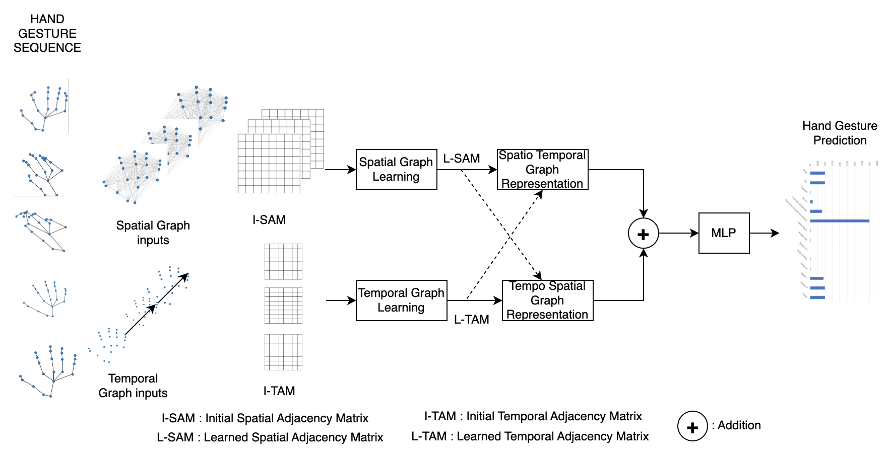

# **HGR / GCN**

This repository contains the source code for our paper:

**DGCN**



## **Updates**
- ...

## **Installation**
Create and activate conda environment:
```
conda create -n DGCN_env python=3.10
conda activate DGCN_env
```

Install all dependencies:
```
pip install -r requirements.txt
```

### Demos

## Dataset

By default, the 3D hand joints training dataset is structured as follows for each sequence (see example in `./datasets/`):

```
## frames 1
x1, y1, z1
x2, y2, z2
...
...
x21, y21, z21

## frame 2
x1, y1, z1
x2, y2, z2
...
...
x21, y21, z21

## frame t
...

## frame T
x1, y1, z1
x2, y2, z2
...
...
x21, y21, z21

```


## Training

```
python train.py --params
```


## Citation
If you find this repo useful, please consider citing our paper

```ref```

## Notes
This code borrows from [SGCN](https://github.com/shuaishiliu/SGCN/tree/0ff25cedc04852803787196e83c0bb941d724fc2).
