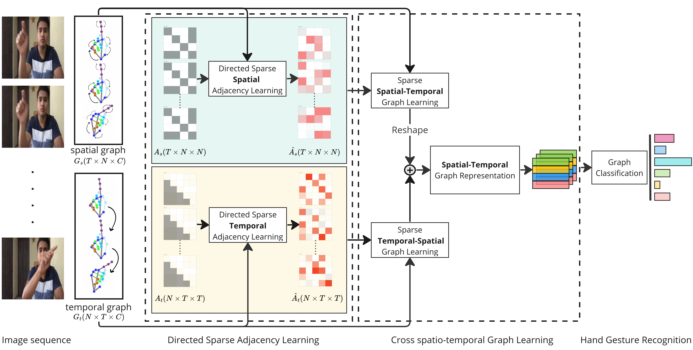

# **ST-SGCN**

This repository contains the source code for our paper: Spatio-Temporal Sparse Graph Convolution Network for Hand Gesture Recognition

**Our approach**

The main steps include:
  
1. Decoupled learning of **directed** and **sparse** spatial and temporal interactions, using attention mechanism and asymmetric convolutions. 

2. Acquiring **cross-spatial-temporal** graph representations, by capturing both spatial-temporal and temporal-spatial interactions.



## **Updates**
- ...

## **Installation**
Create and activate conda environment:
```
conda create -n DGCN_env python=3.10
conda activate DGCN_env
```

Install all dependencies:
```
pip install -r requirements.txt
```

### Demos

## Dataset

By default, the 3D hand joints training dataset is structured as follows for each sequence (see example in `./datasets/`):

```
## frames 1
x1, y1, z1
x2, y2, z2
...
...
x21, y21, z21

## frame 2
x1, y1, z1
x2, y2, z2
...
...
x21, y21, z21

## frame t
...

## frame T
x1, y1, z1
x2, y2, z2
...
...
x21, y21, z21

```


## Training

1. Download the [SHREC’17 Track Dataset](http://www-rech.telecom-lille.fr/shrec2017-hand/) , the [Briareo Dataset](https://drive.google.com/file/d/1IgxNfO_RprNjI0weYfser1OjzymZZQ78/view) , the [SHREC'21 Dataset](https://univr-vips.github.io/Shrec21) and the Extracted landmarks [IPN Dataset](https://drive.google.com/file/d/19cGm7vSKoVdlCzEOqcUkDiyMgFJdKgmG/view?usp=drive_link) 
2. Set the path to you dataset in `train.py (line 107)`
3. Run the following command to train the model
```
python train.py --params
```
1. Download the best pre-trained model : [Briareo](https://drive.google.com/file/d/14WUYFKN3A9QHUanDM3oEq61BjggHt-VC/view) , [SHREC17](https://drive.google.com/file/d/1ZXBj_uSKkfS59mq-Kee04ecnIvZwkKva/view?usp=drive_link) , [SHREC21](https://drive.google.com/file/d/1Ld4aK5knU8XjRyO_EpOipCxzYpHLZMew/view?usp=drive_link) and [IPN](https://drive.google.com/file/d/14uDiEpaZ_I10WOva8jO3WzsnhuPLqBFZ/view?usp=drive_link)
## Citation
If you find this repo useful, please consider citing our paper

```ref```

## Notes
This code borrows from [SGCN](https://github.com/shuaishiliu/SGCN/tree/0ff25cedc04852803787196e83c0bb941d724fc2).
